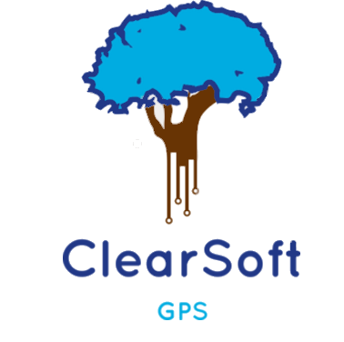

# Peso Tips

Proyecto de Gestion de proyectos de software, encargado de calcular la masa corporal utilizando
dos sistemas

* Internacional 
* Ingles

***
## Equipo GPS

Equipo GPS.

## Integrantes del proyecto

***
* Daniel Martinez Sierra 
* Marcos Laguna Velazquez
* Rodrigo Eredia 
* Betzabet salas 
* Karla Estrada

## Actualizacion (Diciembre 2017)

Aplicando katas de refactoring para mantenimiento de codigo 

	by Daniel Martinez