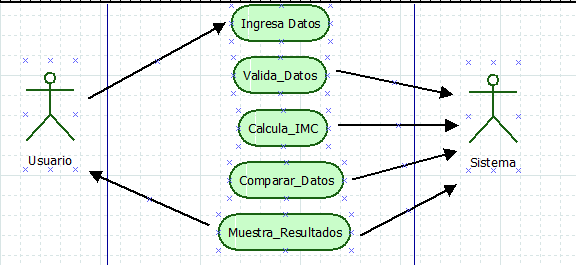

# DOCUMENTACION

Empresa de desarrollo.

## DESCRIPCION DEL PROYECTO 
La organización española Pesotips necesita actualizar su portal Web (http://pesotips.com/) ya que la calculadora del Índice de Masa Corporal (IMC) que maneja presenta errores, está en inglés y resulta muy básica para las expectativas de la organización.

## REQUERMIIENTOS

**Req1:** Se Requiere de una aplicación que calcule el IMC (índice de masa corporal), proporcionando el peso y la estatura respetando el diseño original. 

    
    
Portal Peso Tips.

**Req2:** Poner un mensaje alusivo a cada una de las 8 condiciones de la tabla de cálculo de IMC. Las cuales son 
* Delgadez severa 
* Delgadez moderada
* Delgadez leve
* Normal 
* Preobeso
* Obesidad leve
* Obesidad Media 

    
    
Diseño del nuevo portal

**Req 3:** Realizar Validaciones de los datos que ingrese el usuario al intentar calcular su IMC. 

    
    
Diagrama casos de uso

